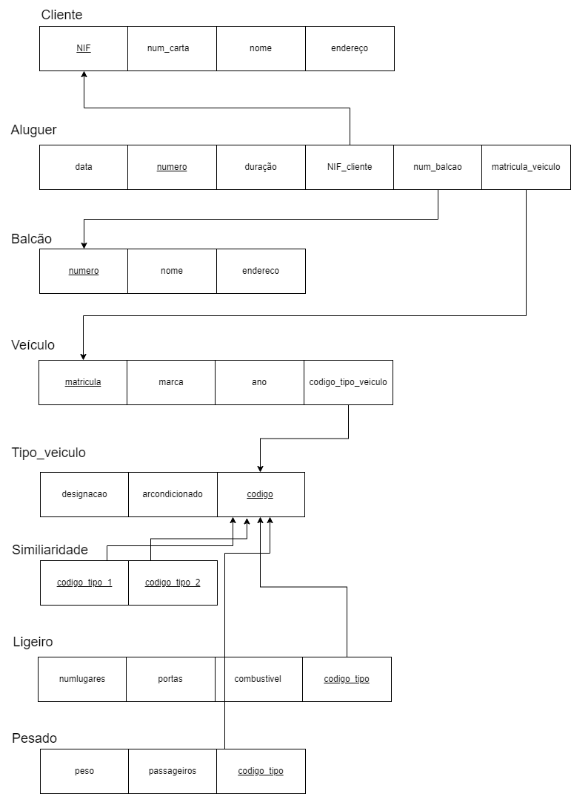

# BD: Guião 3


## ​Problema 3.1
 
### *a)*

```
Relações: 
Cliente: cliente(NIF, num_carta, nome, endereço)
Aluguer: aluguer(data, número, duração, NIF_cliente, num_balcao, matricula_veiculo)
Balcão: balcao(nome, número, endereço)
Veículo: veiculo(ano, matrícula, marca, código_tipo_veiculo)
Tipo_veículo: tipo_veiculo(designação, ar_condicionado, código)
Similaridade: similaridade(codigo_tipo_1, codigo_tipo_2)
Ligeiro: ligeiro(numlugares, portas, combustível, código_tipo)
Pesado: pesado(peso, passageiros, código_tipo)

```


### *b)* 

```
Cliente: 	Chaves candidatas -> num_carta, NIF
		Chaves primárias -> NIF
		Chaves estrangeiras -> 

Aluger: 	Chaves candidatas -> número
		Chaves primárias -> número
		Chaves estrangeiras -> Titular, Local, Objecto

Balcão: 	Chaves candidatas -> número
		Chaves primárias -> número
		Chaves estrangeiras -> 

Veículo: 	Chaves candidatas -> matrícula
		Chaves primárias -> matrícula
		Chaves estrangeiras -> Tipo

Tipo_veiculo: 	Chaves candidatas -> código
			Chaves primárias -> código
			Chaves estrangeiras ->

Similaridade: 	Chaves candidatas -> código_tipo_1, código_tipo_2
			Chaves primárias -> código_tipo_1, código_tipo_2
			Chaves estrangeiras -> 

Pesado: 	Chaves candidatas -> código
		Chaves primárias -> código
		Chaves estrangeiras -> código

Ligeiro: 	Chaves candidatas -> código
		Chaves primárias -> código
		Chaves estrangeiras -> código

```


### *c)* 




## ​Problema 3.2

### *a)*

```
Airport: airport(Airport_Code, City, State, Name)

Airplane_Type: airplane_type(Company, Type_Name, Max_Seats)

Airplane: airplane(Airplane_Id, Total_No_Of_Seats)

Flight: flight(Number, Airline, Weekdays, airplane_type)

Flight_Leg: flight_leg(Leg_no, Flight_number, Airpor_Code_Dep, Airport_Code_Arr, Schedule_Dep_Time, Schedule_Arr_Time)

Fare: fare(Code, Amount, Restrictions, Flight_Number)

Leg_Instance: leg_instance(Date, No_Of_Avail_Seats, Leg_No, Flight_Number, Airport_Code_Dep, Airport_Code_Arr, Dep_Time, Arr_Time, Airplane)

Seat: seat(Date, Seat_No, Flight_Number, Leg_Number, Costumer_Name, Phone)

Can_Land: can_land(Airplane_Type, Airport)


```


### *b)* 

```
Airport: 	Chaves candidatas -> airport_code, Name
		Chaves primárias -> airport_code
		Chaves estrangeiras -> 

Airplane Type: 	Chaves candidatas -> type_name
			Chaves primárias -> type_name
			Chaves estrangeiras -> 

Airplane: 	Chaves candidatas -> airplane_id
		Chaves primárias -> airplane_id
		Chaves estrangeiras -> airplane_type

Fligth: 	Chaves candidatas -> number
		Chaves primárias -> number
		Chaves estrangeiras ->

Fligth_Leg: Chaves candidatas -> leg_no
		Chaves primárias -> leg_no
		Chaves estrangeiras -> flight_number, leg_number, cod_airport_arr, cod_airport_dep

Fare: 	Chaves candidatas -> code
			Chaves primárias -> code
			Chaves estrangeiras -> flight_number

Leg_instance: 	Chaves candidatas -> date
			Chaves primárias -> flight_number, leg_no, date
			Chaves estrangeiras -> Flight_Number, Leg_No, Airport_Code_Dep, Airport_Code_Arr, Date, Airplane_id

Seat: 	Chaves candidatas -> Seat_no, costumer_name
		Chaves primárias -> Seat_No
		Chaves estrangeiras -> Flight_Number, Leg_Number, Date, Flight_number

Can_Land: 	Chaves candidatas -> Airport_code, type_name
		Chaves primárias -> airport_code, type_name
		Chaves estrangeiras -> airport_code, type_name
```


### *c)* 


## ​Problema 3.3


### *a)* 2.1


### *b)* 2.2


### *c)* 2.3


### *d)* 2.4

